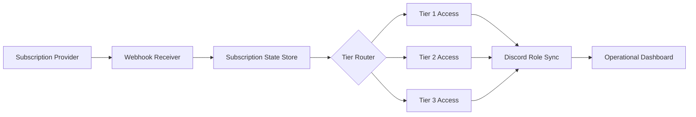
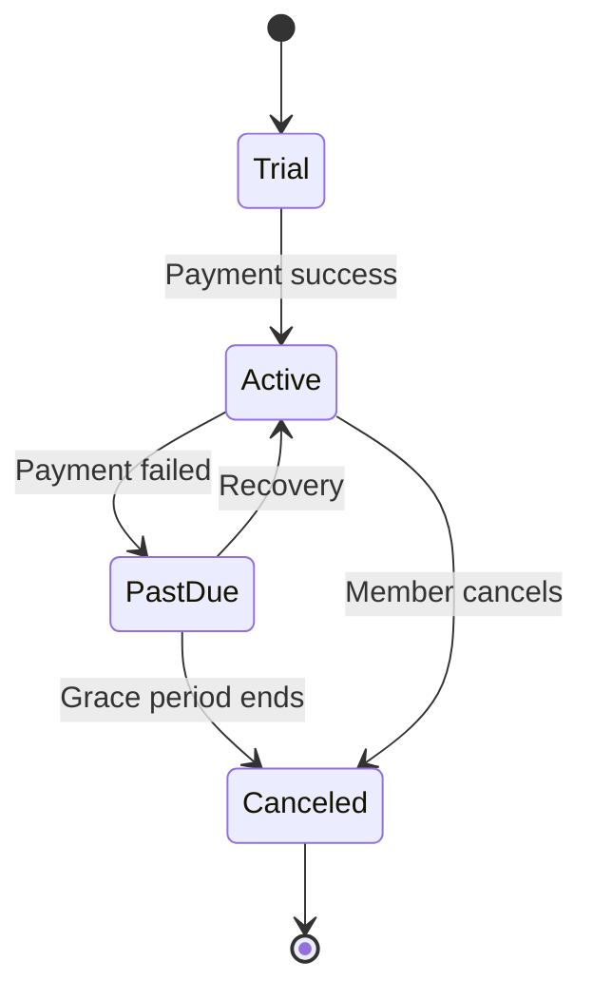

# Discord Trading Automation

Subscription routing and operational automation framework for trading communities.

> **Scope note:** This repository focuses on **operational workflow architecture** — subscription management, routing, and communication systems. It intentionally does **not** include proprietary trading strategies, trade logic, or any financial promises.
---

## Overview

An automation framework for running subscription-based communities on Discord: managing membership state, routing communications, and keeping operations consistent and scalable.

## Problem

Subscription communities accumulate manual operational work — onboarding members, managing access tiers, routing communications, and handling churn — that doesn't scale by hand.

## Operational Challenges

- Manual member onboarding and offboarding
- Inconsistent communication and routing
- Access tiers managed by hand
- No reliable operational dashboard for community health

## Solution

A workflow-first automation layer that standardizes subscription lifecycle management and communication routing, so operations stay consistent as the community grows.

## Features

- Workflow architecture
- Subscription lifecycle automation
- Routing concepts
- Communication systems
- Operational dashboards

## Architecture

See [`docs/architecture.md`](docs/architecture.md) for the full subscription lifecycle, tier routing, and communications diagrams.

## Workflow Example

1. A subscription event (new, renewed, canceled) is received.
2. Routing logic updates the member's access tier in Discord.
3. Communication is sent based on lifecycle stage.
4. Operational dashboard reflects community membership health.

## Tech Stack

- Discord APIs
- Stripe APIs (subscription events)
- Automation / routing layer

## Screenshots

Workflow and dashboard visualizations are maintained as Mermaid diagrams in [`docs/architecture.md`](docs/architecture.md). Example: subscription lifecycle states.

## Lessons Learned

The durable value is in the operational layer — reliable subscription state and clean routing — not in any single piece of content the community is built around.
