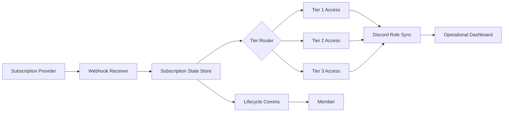
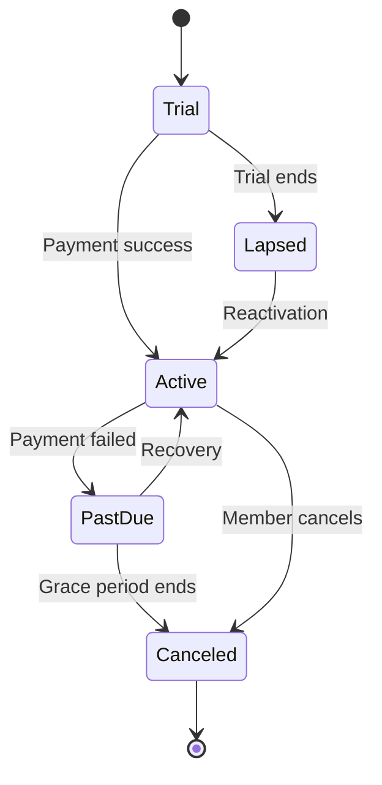
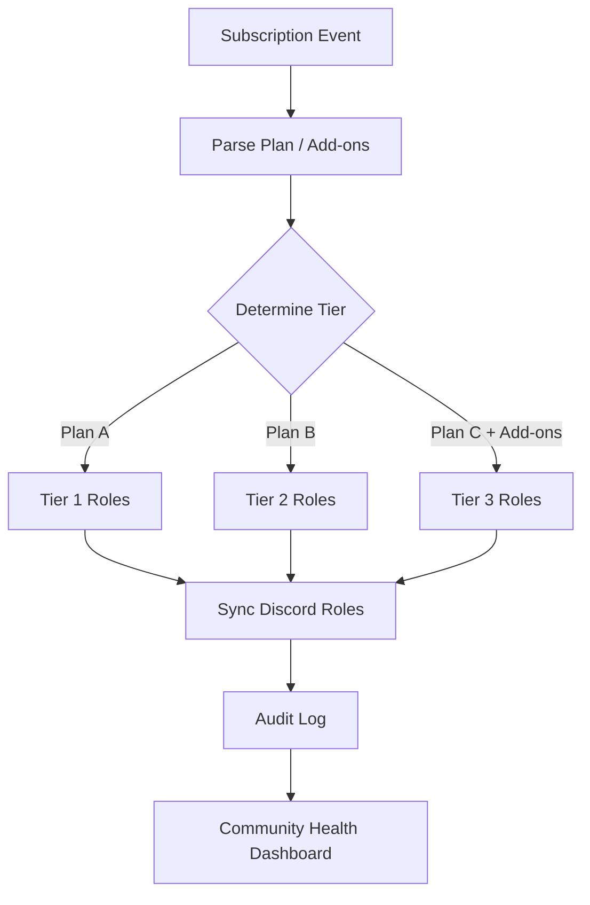
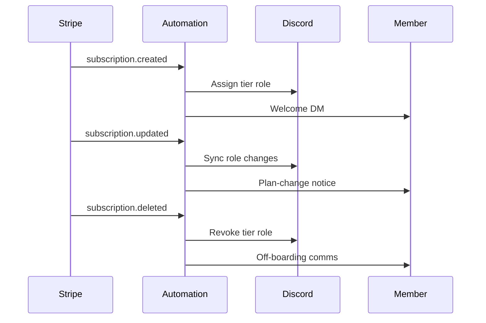

# Discord Trading Automation — Architecture

> Scope: workflow architecture, subscription lifecycle, and routing concepts only. No proprietary trading strategy logic is documented in this repository.

## System Architecture

## Subscription Lifecycle

## Tier Routing Logic (Conceptual)

## Session & Communications

